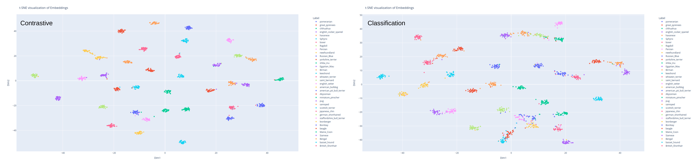
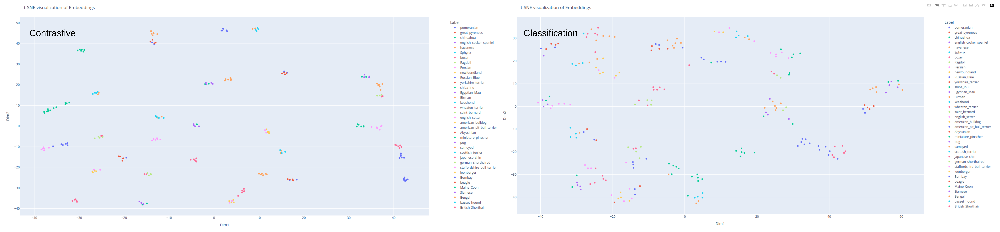

# Contrastive methods learn better embeddings than classification based learning

## Introduction

### Hypothsis
- <b>Supervised contrastive learning learns more semantically richer embeddings than classification based learning. 
- Contrastive based learning especially performs way better when the number of datapoints per class is low</b>

### Reasons

- <b>Contrastive learning allows the model to see a single datapoint multiple times in comparison with other datapoints.</b><br>
For an example, in triplet based training, for each anchor image, the positive will be another image from the same class and the negative will be an image from another class. The amount of ways to pick the positive and negative is large. Therefore for each image(anchors) we can feed it to the model multiple times and let the model learn different features from it.

- <b>The size of the supervisory signal is larger and more diverse in contrastive learning</b><br>
In classficaion based learning the supervisory signal will be the size of the number of classes. The signal will force the correct class to have a higher value in the classification layers' node, and all other nodes to have a lower value. But in contrastive learning we compare embeddings. Now the supervisory signal will have the size of the embedding. Also as each an every variable in the embedding is compared with another embedding, the supervisory signal can force some variables in the embedding to increase and for some to decrease.

### Results<br>

We use the convnext model <a href="https://arxiv.org/abs/2201.03545" target="_blank">(Paper link)</a>  as the backbone for our training and use IN22k weights as the initialization <a href="https://huggingface.co/timm/convnext_tiny.fb_in22k" target="_blank">(huggingface model card)</a>. 

We test our model on  <a href="https://pytorch.org/vision/main/generated/torchvision.datasets.OxfordIIITPet.html" target="_blank">oxford pet dataset</a> and  <a href="https://www.kaggle.com/datasets/joebeachcapital/defungi?resource=download" target="_blank">microscopic images dataset</a> using the full datasets and also under low data per class setting. For contrastive learning we use triplet based training.

- <b>Using the full dataset</b>

| Model                            | K-means acc           |  
| -------------------------------- | --------------------- | 
| `pet_classification_convnext`    |       88.97%          |  
| `pet_contrastive_convnext`       |       <b>96.01%</b>   |
| `micro_classification_convnext`  |       85.54%          |  
| `micro_contrastive_convnext`     |       <b>97.43%</b>   |

Pet dataset<br>
<br>

Micro dataset<br>
<br>

- <b>Low data (using 15 images per class)</b>

| Model                            | K-means acc           |  
| -------------------------------- | --------------------- | 
| `pet_classification_convnext`    |       55.41%          |  
| `pet_contrastive_convnext`       |       <b>82.43%</b>   |
| `micro_classification_convnext`  |       56.67%          |  
| `micro_contrastive_convnext`     |       <b>66.67%</b>   |

Pet dataset<br>
<br>

All clustering plots can be viewed interactively [here](outputs). (Recommended to download the .html file and open in the browser)

## Reproduce results

### Prepare data

Download <a href="https://pytorch.org/vision/main/generated/torchvision.datasets.OxfordIIITPet.html" target="_blank">oxford pet dataset</a> and <a href="https://www.kaggle.com/datasets/joebeachcapital/defungi?resource=download" target="_blank">microscopic images dataset</a>  and place in the data folder.

Download the <a href="https://drive.google.com/drive/folders/1a-zzC2Gyu-7nwQ6KanNKCFcw099U6E6w?usp=sharing" target="_blank">annots</a> folder and place in the data folder.

    ├── data                   
        ├── annots         
        ├── microscopic_images    
        ├── oxford-iiit-pet     

### Training

Run the following command,

```bash
python main.py --config "path_to_config_file" --device "device_id"
```
Example:
Run training for pet classification,
```bash
python main.py --config configs/pet_convnext_classi_config.yaml --device 0
```

You can easily change the config files to run these tests on custom datasets after preparing the dataset accordingly.

